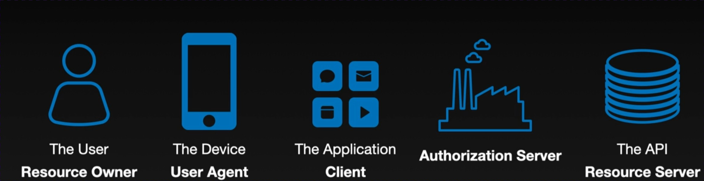

## Application Types

### 机密客户端 (Confidential Clients)

- **定义**：能够安全保管凭证（最常见的是`client_secret`）的客户端。
- 典型代表
  - **后端Web应用**（用Java, Python/FastAPI, PHP, .NET等编写）。
  - 任何运行在你**自己控制的服务器**上的代码。
- 为什么能保密？
  - 因为代码和配置文件都运行在你的服务器上，最终用户（通过浏览器访问你网站的人）无法看到你的源代码、环境变量或配置文件。
  - 这就像你把API密钥放在服务器的环境变量里一样，用户是绝对访问不到的。
- 凭证是什么？
  - 最常见的是 **`client_secret`**：一个由授权服务器生成的、长长的、像密码一样的字符串。你把它配置在你的后端应用里。
  - 更高级、更安全的方式包括：**mTLS客户端证书** 或 **使用私钥签名的JWT**。这些方式更复杂，通常用于高安全级别的场景（如金融支付）。

### 2. 公共客户端 (Public Clients)

- **定义**：**无法**安全保管任何秘密凭证的客户端。
- 典型代表
  - **单页应用 (SPA)**，如用React, Vue, Angular构建的前端应用。
  - **原生移动应用**（iOS, Android）。
  - **桌面应用**。
  - **物联网设备 (IoT)**、Apple TV应用等。
- 为什么不能保密？
  - 因为这些应用的代码（或其编译后的产物）最终都运行在**用户控制的设备**上。
  - **对于SPA**：用户在浏览器里随时可以“查看源代码”或打开开发者工具，直接看到你写在JavaScript代码里的任何字符串。把`client_secret`放进去就等于公之于众。
  - **对于移动/桌面应用**：虽然没有“查看源代码”按钮，但黑客或有技术能力的用户可以使用反编译工具、字符串提取工具等手段，从应用的二进制文件中把所谓的“秘密”挖出来。

**一个黄金法则：只要代码运行在用户能控制的设备上，就不能把任何秘密硬编码进去。**

------

### 3. 这个区别为什么如此重要？（对授权服务器的影响）

授权服务器（如Keycloak）知道客户端是“机密”还是“公共”之后，会采取**完全不同**的安全策略。

**对于机密客户端：**

- **可以进行客户端认证**：当机密客户端向授权服务器请求令牌时，它需要同时出示自己的`client_id`和`client_secret`。
- **信任度更高**：授权服务器知道，能拿出正确`client_secret`的，**一定是你那个真实的后端应用**，而不是某个冒名顶替者。
- 可以获得更高权限或更便利的流程
  - **可能跳过用户同意页面 (Consent Screen)**：如果是第一方应用，服务器可以确信是自家人，就没必要再问用户“你是否同意授权给XX应用”了。
  - **可以获得刷新令牌 (Refresh Token)**：这是一种长效令牌，可以让应用在用户不在线时也能刷新`access_token`，用于执行后台任务。因为服务器相信应用能保管好它。
  - **`access_token`的生命周期可能更长**。

**对于公共客户端：**

- **无法进行客户端认证**：它没有`client_secret`，请求时只能报上自己的`client_id`（这是公开的）。
- **信任度更低**：授权服务器**无法确定**这个请求是来自你真正的SPA或移动应用，还是来自一个模仿者（比如一个恶意应用，拷贝了你的`client_id`来发起请求）。
- 安全策略更严格，以降低风险
  - **通常必须显示用户同意页面**。
  - **可能不颁发刷新令牌**，或者颁发的刷新令牌有更严格的使用限制（比如必须轮换）。
  - **`access_token`的生命周期通常很短**（比如5分钟），以减少令牌泄露后的危害。
  - **强制使用更安全的授权流程**，比如 **PKCE (Proof Key for Code Exchange)**，这是专门为公共客户端设计的一个防劫持技术。

------

### 总结与实践建议

- 是什么？
  - **机密客户端 (Confidential)** = 后端应用，能藏住秘密。
  - **公共客户端 (Public)** = 前端/移动应用，藏不住秘密。
- 为什么重要？
  - 它决定了授权服务器对你的信任程度，并直接影响到安全策略（如是否给Refresh Token、Token有效期多长等）。
- 作为开发者，你该怎么做？
  1. **正确注册**：在授权服务器（如Keycloak）上注册你的应用时，必须根据你的应用类型，准确选择“Confidential”或“Public”。
  2. **严守秘密**：如果你的应用是机密的，**绝对不要泄露你的`client_secret`**。像保护数据库密码一样保护它。
  3. **不要自作聪明**：**永远、永远不要把`client_secret`放到任何前端JavaScript代码、移动应用或桌面应用中。** 这样做不仅没用，还会带来巨大的安全风险。

简而言之，诚实地告诉授权服务器你的应用类型，并遵循相应的安全最佳实践，是构建一个安全OAuth系统的第一*步。