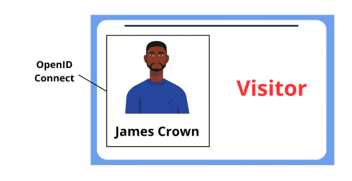

## OpenID Connect 带来了什么

OAuth 2.0 在授权方面非常出色，它让应用程序无需处理密码即可访问用户数据。但 OAuth 本身并不能告诉你用户是谁。这就是 OpenID Connect (OIDC) 的用武之地。它并不是 OAuth 的替代品，而是在其基础上将身份概念引入框架的一个层。

把 OAuth 想象成一个协议，它能让你获得大楼的访客徽章。OpenID Connect 是在徽章上打印你的姓名和照片的功能。它为令牌提供了上下文，并将其与可验证的用户联系起来。

OpenID Connect 通过ID Token实 现这一目标，ID 令牌是一种专门制作的 JSON 网络令牌（JWT），其中包含已通过身份验证的用户的信息。该令牌由身份提供者（IdP）签名，并包含以下 “声明”：

- *sub*: Subject identifier (a unique user ID)
- *name*: Full name of the user
- *email*: Verified email address
- *iat*: When the token was issued
- *exp*: When the token expires

These claims let the client application know who the user is and some basic information about them, all verified by a trusted third party. The client doesn’t need to store passwords or build its own identity verification mechanism; it can trust the identity that the ID token asserts.

## How OpenID Connect Works

那么，OpenID Connect 实际是如何工作的呢？

OIDC 以 OAuth 流程为基础，引入了几个关键步骤，将用户身份与访问请求安全地联系起来。

1. User Initiates Login via the Identity Provider (IdP)

   The user starts the login process by being redirected to a trusted identity provider.

2. The IdP Authenticates the User

   The identity provider verifies the user’s credentials through its own login system.

3. Consent is Requested

   The user is prompted to approve the sharing of their identity information with the requesting app.

4. The App Receives an Authorization Code

   Once consent is granted, the identity provider sends the app a temporary authorization code.

5. The App Exchanges the Code for Tokens

   The app exchanges the authorization code for two tokens:

   - an **access token** for protected resources
   - an **ID token** containing identity claims

6. The App Extracts and Verifies Identity

   These include things like user ID, name, and email, cryptographically signed by the IdP.

Because OpenID Connect uses JWT for its ID tokens, all the user data is self-contained and cryptographically signed. That means your application can validate the token’s signature and expiration without needing to ping the IdP repeatedly. That’s great for performance and reliability.

The beauty of OpenID Connect lies in its simplicity and extensibility. It’s built for the modern web, mobile, and APIs. Whether you’re building a social media platform or a fintech app, OIDC gives you the tools to verify users in a secure, scalable way.

https://blog.secureflag.com/